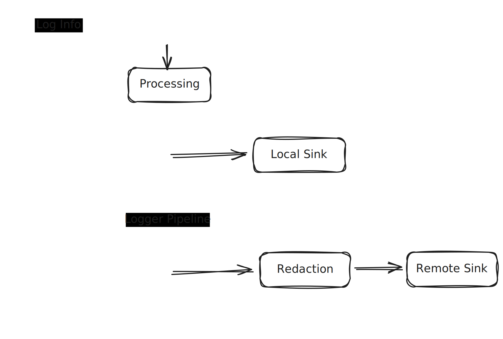
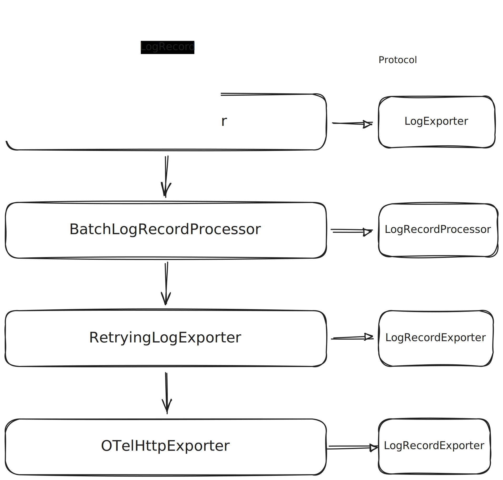

# 一、为什么需要日志

软件系统的运行过程本质上是不可见的。绝大多数行为发生在内存与线程之中。在本机调试阶段，我们可以借助断点、内存分析、控制台等手段直接观察系统状态；而一旦进入生产环境，这些能力几乎全部失效。此时，日志成为**唯一能够跨越时间和空间的观测手段**。

但如果进一步追问：**日志究竟解决了什么问题？**这个问题并没有那么简单。日志的核心价值并不在于文本本身，而在于**可见性**。它最基础的作用，是让这些不可见的行为“显影”。一次简单的日志输出，至少隐含了三类信息：时间、位置、描述。

这也是我们不建议使用简单 print 的原因：结构化日志在每次记录时，都会自动携带这些关键信息，从而形成稳定、可检索的观测数据。

之后当系统规模变大、异步逻辑增多时，单条日志已经很难解释问题。真正有价值的，是一组日志所呈现出的**因果关系**. 在这一层面上，日志更像是**事件证据**，用于在事后还原一段已经发生过的执行流程。

接下来，我们将从这些问题出发，逐步讨论一套面向真实生产环境的日志与可观测性设计。

# 二、日志系统

尽管日志在实践中无处不在，它本身仍然存在天然局限：日志是离散的事件，而不是连续的流程;日志天然是“事后信息”，而不是实时状态;在客户端等受限环境中, 如 应用可能随时被杀掉, 各种网络情况不稳定, 隐私与安全限制，日志可能丢失、不可获取、不可上报。

这意味着，**日志并不是系统真相本身**，它只是我们理解系统的一种工具。当系统复杂度继续提升，仅靠“多打日志”往往无法解决根本问题。

## 2.1 范围与功能

这样我们应该勾勒出日志系统的一些边界范围. 

1. 不必要求日志的「绝对可靠上报」
2. 不通过日志修复「系统设计问题」(业务依赖、生命周期、指责转移错误)
3. 不将日志系统演化成「消息系统」(不持久化、不通过日志兜底)

所以我们通过边界范围基本确定了我们日志系统的一些要求:

* **结构化并非文本化:** 日志首先应该是结构化数据，而不是简单字符串。文本只是表现形式，结构才是核心价值.每条日志必须具备稳定的时间、位置、级别与上下文.日志应当天然支持检索、过滤与关联.

* **本地优先, 而非远端依赖:** 本地记录必须是同步、低成本、稳定的.远端上报只能是 best-effort 行为.系统不能因为远端日志失败而影响主流程

## 2.2 系统架构



我们刻意限制了日志系统的职责范围，使其始终作为一个旁路的、可退化的基础设施存在。这些约束并非功能缺失，而是后续实现能够保持稳定与可演进的前提。所有依赖关系均为单向：日志系统不会反向调用业务模块或基础设施。

# 三、本地日志

在整体架构中，本地日志被视为整个日志系统中**最基础、也是最可靠的一环**。无论远端日志是否可用、网络环境是否稳定，本地日志都必须能够在任何情况下正常工作。

因此，在实现层面，我们选择优先构建一套**稳定、低成本、符合平台特性的本地日志能力**，而不是从远端导出反推本地设计。

## 3.1 为什么是os.Logger

在 iOS 开发里，print 很直观，但它更像调试手段：没有结构、难以检索、性能成本不可预测，也无法进入系统日志体系。进入生产环境后，这些缺点会被放大。

os.Logger 是系统级日志通道，它的设计目标本身就面向“可长期运行”的生产场景。本文中，`os.Logger` 指 Apple 的系统日志实现，`Logger` 指本文封装的对外 API。我们选择它，主要基于这些原因：

- 低成本写入：日志被拆分为静态模板与动态参数，格式化发生在读取阶段，而非写入阶段
- 系统工具链一致性：天然接入 Console、Instruments 与系统日志采集工具
- 隐私与合规能力：原生支持隐私级别控制
- 结构化上下文：时间戳、级别、分类、源码位置可以稳定保留

因此，日志可以作为“长期存在的基础能力”，在核心路径中持续开启，而不是仅限于调试阶段。需要说明的是，系统日志在生产环境的获取也受平台权限与采集策略限制，所以它是“本地可靠”，但并不是“远端万能”。

在使用层面，Logger API 保持简单直接：

```swift
let logger = Logger(subsystem: "LoggerSystem")
logger.info("Request started")
logger.error("Request failed", error: error)
```

## 3.2 附加功能

除了系统日志的即时写入，我们还提供了几个本地诊断能力：通过 `LogStore` / `OSLogStore` 进行日志检索（按时间、级别、分类）并支持导出为文本或 JSON；同时集成 `OSSignpost` / `OSSignposter` 作为性能事件记录方式，用于衡量关键路径耗时。这些能力不进入主写入路径，只在排查与分析时启用。

# 四、远端日志与 OpenTelemetry

## 4.1 OpenTelemetry 在客户端日志系统中的位置

OpenTelemetry 由 CNCF 托管，起源于 2019 年 OpenCensus 与 OpenTracing 的合并，并于 2021 年成为 CNCF 顶级项目。它并不是某一个具体 SDK，而是一套**用于描述可观测性数据的开放标准**，定义了日志、指标与链路追踪的统一语义与数据模型，并配套给出了标准化的传输协议（OTLP）。

在本章中，我们并不试图完整覆盖 OpenTelemetry 的体系，而是聚焦于其中与**远端日志**相关的部分：

**日志数据在 OTel 语义下如何被结构化、如何被分组、以及如何被导出。**

认证、上下文传播等问题会显著影响系统依赖关系，本文刻意将其延后，在下一章单独讨论。

#### 4.1.1 **Remote Logger 的最小闭环**

下图展示了在 OTel 语义下，客户端远端日志链路的**最小可用闭环**：

这一闭环的目标并非“可靠投递”，而是在客户端约束条件下，提供一条**可控、可退化的日志导出路径**。

从数据流动的角度看，这条链路可以被抽象为：

```
LogRecord[]
  → LogRecordAdapter
  → ResourceLogs / ScopeLogs / LogRecords
  → ExportLogsServiceRequest (OTLP)
  → OTLP Exporter (HTTP / gRPC)
```

在这一结构之上，可以按需叠加增强能力，例如批处理、失败缓存或延迟调度，但这些能力**不会改变日志的协议语义**。

#### 4.1.2 **结构化与分组：从 LogRecord 到 OTel Logs**

在 OTel 模型中，LogRecord 仍然是最小的事件单元，用于描述“发生了什么”。

但真正的上传结构并不是一组扁平的日志列表，而是按以下层级组织：

- **ResourceLogs**：描述日志产生的资源环境（设备、系统、应用）
- **ScopeLogs**：描述产生日志的逻辑作用域（模块、库）
- **LogRecords**：具体的日志事件

这一分组方式的意义在于：

- 避免重复携带环境信息
- 明确日志的来源与归属
- 为后端聚合与分析提供稳定结构

在客户端侧，这一阶段通常通过一个 Adapter 或 Mapper 完成，其职责只是**语义映射**，而非业务处理。

#### 4.1.3 **批处理与调度：Processor 的职责边界**

在日志被结构化之后，下一步并不是立刻发送，而是进入处理阶段。

LogRecordProcessor 位于这一阶段的入口位置。以 BatchLogRecordProcessor 为例，它负责：

- 将多条日志聚合为批次
- 控制发送频率
- 降低网络与系统调用成本

需要注意的是，Processor 层体现的是**策略位置**，而不是协议逻辑。

它不关心日志如何被编码，也不关心最终通过何种方式发送，只负责决定**什么时候值得尝试导出**。

#### 4.1.4 **导出边界：Exporter 作为协议适配层**

LogRecordExporter 是远端日志链路中的**协议边界**。

在这一层中，结构化日志会被转换为 OTLP 定义的 ExportLogsServiceRequest，并通过具体传输方式发送。常见实现包括：

- OTLP/HTTP
- OTLP/gRPC

无论采用哪种方式，Exporter 的核心职责都是一致的：

**编码日志结构，并完成协议级发送。**

它不感知业务上下文，也不参与重试策略之外的系统决策。

## 4.2 RemoteLogger 架构图

下面这张图是 RemoteLogger 在 OTel 语义下的最小闭环：



# 五、上下文边界

从 RemoteLogger 开始真正发日志的那一刻，日志系统就第一次碰到外部依赖：鉴权。它不是“可选附加项”，而是远端链路的必经之门。

## 5.1 鉴权

日志端点是基础设施入口（infra endpoint），它的目标是**控制写入来源**，而不是验证用户身份。因此更合理的鉴权方式是：IP allowlist、mTLS、ingestion key、project‑level key，配合采样与限流。这些机制与用户态解耦、无需刷新、不参与业务控制流，且失败也不会影响客户端主流程。

在这种模型下，日志系统只做一件事：**携带已准备好的凭证**。它不维护鉴权状态，也不触发刷新，更不等待鉴权完成。

### 5.1.1 当鉴权被卷入业务流程

问题发生在日志复用业务鉴权体系时：access token 短期、频繁刷新、刷新依赖网络与生命周期，而鉴权失败本身又需要被记录。直觉做法是“刷新后重试”，但这会形成典型的依赖循环：

```
Logger
  → RemoteExporter
     → AuthManager
        → RefreshToken
           → Network
              → Logger
```

这不是实现复杂的问题，而是依赖方向错误的问题：日志系统依赖了本应被它观测的系统，直接造成 **auth blind zone（鉴权失败本身无法被观测的区域）**。

现实里，很多团队不得不复用业务鉴权，但这时唯一能做的是“隔离副作用”：不触发刷新、不重试鉴权、失败即丢弃，并保持凭证只读与短生命周期缓存。这样做无法消灭问题，却能把依赖循环缩到最小。

结论只有一句：**日志系统只能消费鉴权结果，不能成为鉴权流程的一部分。**

## 5.2 Traceparent

traceparent 是 W3C Trace Context 标准里的核心头部，用于跨进程传播 Trace。它不是日志系统的一部分，而是“流程上下文”的载体。日志系统只负责把它携带出去，而不负责生成、维护或推进它。

它的基本结构非常固定：

```
traceparent: {version}-{trace-id}-{parent-id}-{trace-flags}
```

- **version**：版本号，当前常见为 `00`
- **trace-id**：16 字节（32 hex）的全局 trace 标识
- **parent-id**：8 字节（16 hex）的当前 span 标识
- **trace-flags**：采样与调试标记（如 `01` 表示采样）

这四个字段共同决定“这条日志属于哪条 trace、处于哪一段 span 上下文”。

### 5.2.1 构造与传递

在客户端日志系统中，traceparent 应当被视为**外部上下文**：

- 它由业务流程或 tracing 系统生成
- 它随着请求/事件生命周期变化
- 它不由日志系统创建，也不由日志系统维护

日志系统只做一件事：在日志生成或导出时附带 traceparent，让后端能够把日志与 Trace 对齐。

这也意味着：日志系统不能尝试“修复” traceparent，也不能在缺失时伪造它。缺失就缺失，伪造会制造错误的因果链。

traceparent 的构造来自 tracing 系统（SDK 或上游服务），它会在一次请求开始时生成新的 trace-id，并在 span 变化时更新 parent-id。日志系统只需在“生成日志的瞬间”读取当前上下文并携带即可。

换句话说，traceparent 的生命周期与日志系统无关，而与业务流程一致。日志系统需要尊重这个边界，否则它会再次变成主流程的一部分。

## 5.3 Context 的角色

如果说 traceparent 是“具体的上下文载体”，那么 Context 是“上下文在系统里的容器与作用域”。它回答的不是“字段长什么样”，而是“这份上下文从哪来、到哪去、何时结束”。

在日志系统里，Context 只应当承担两件事：

1. **携带流程信息**，让日志具备可关联性
2. **限定生命周期**，避免上下文在系统内滞留

这意味着 Context 的设计重点不是“存什么”，而是“何时注入、如何传播、何时释放”。

更宽泛地看，Context 的生命周期其实是一种“作用域建模”。它既像 tracing 里的 active span，也像 DI 里的 scope：谁负责创建、谁负责结束、跨线程如何继承，这些都会直接决定 traceparent 的 parent-id 何时变化。换句话说，Context 的问题往往不是协议问题，而是作用域与生命周期策略的问题。

Context 最难的部分其实是作用域与注入方式：

- 它和依赖注入（DI）的关系应该是什么
- 在多线程/异步场景中，Context 的边界如何定义
- Context 是否应该是显式传参，还是隐式绑定

这些问题没有一个完美答案，需要团队给出清晰的工程约定。

## 5.4 结语

这套日志系统的核心不是“更多日志”，而是“正确的边界”：本地优先、远端旁路、结构化可关联、上下文可控。真正决定系统稳定性的，不是某一个 API，而是你如何定义依赖方向与生命周期。最后想留下的一句话是：**可观测性不是无限的，它永远受平台约束。**
